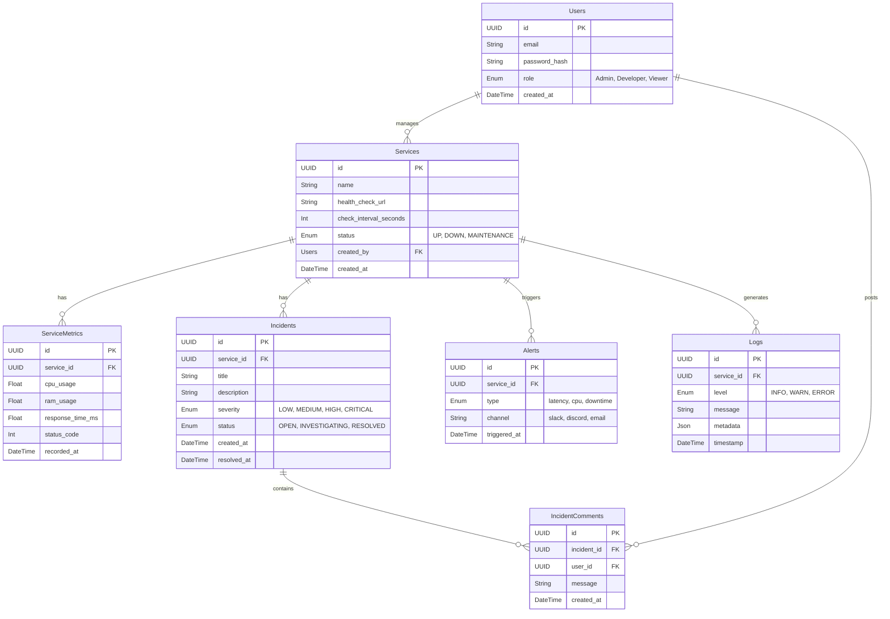

# ER Diagram: Tables + Relations

```mermaid
erDiagram
    Users {
        UUID id PK
        String email
        String password_hash
        Enum role "Admin, Developer, Viewer"
        DateTime created_at
    }

    Services {
        UUID id PK
        String name
        String health_check_url
        Int check_interval_seconds
        Enum status "UP, DOWN, MAINTENANCE"
        Users created_by FK
        DateTime created_at
    }

    ServiceMetrics {
        UUID id PK
        UUID service_id FK
        Float cpu_usage
        Float ram_usage
        Float response_time_ms
        Int status_code
        DateTime recorded_at
    }

    Incidents {
        UUID id PK
        UUID service_id FK
        String title
        String description
        Enum severity "LOW, MEDIUM, HIGH, CRITICAL"
        Enum status "OPEN, INVESTIGATING, RESOLVED"
        DateTime created_at
        DateTime resolved_at
    }

    IncidentComments {
        UUID id PK
        UUID incident_id FK
        UUID user_id FK
        String message
        DateTime created_at
    }

    Alerts {
        UUID id PK
        UUID service_id FK
        Enum type "latency, cpu, downtime"
        String channel "slack, discord, email"
        DateTime triggered_at
    }

    Logs {
        UUID id PK
        UUID service_id FK
        Enum level "INFO, WARN, ERROR"
        String message
        Json metadata
        DateTime timestamp
    }

    Users ||--o{ Services : manages
    Users ||--o{ IncidentComments : posts
    Services ||--o{ ServiceMetrics : has
    Services ||--o{ Incidents : has
    Services ||--o{ Alerts : triggers
    Services ||--o{ Logs : generates
    Incidents ||--o{ IncidentComments : contains
```
