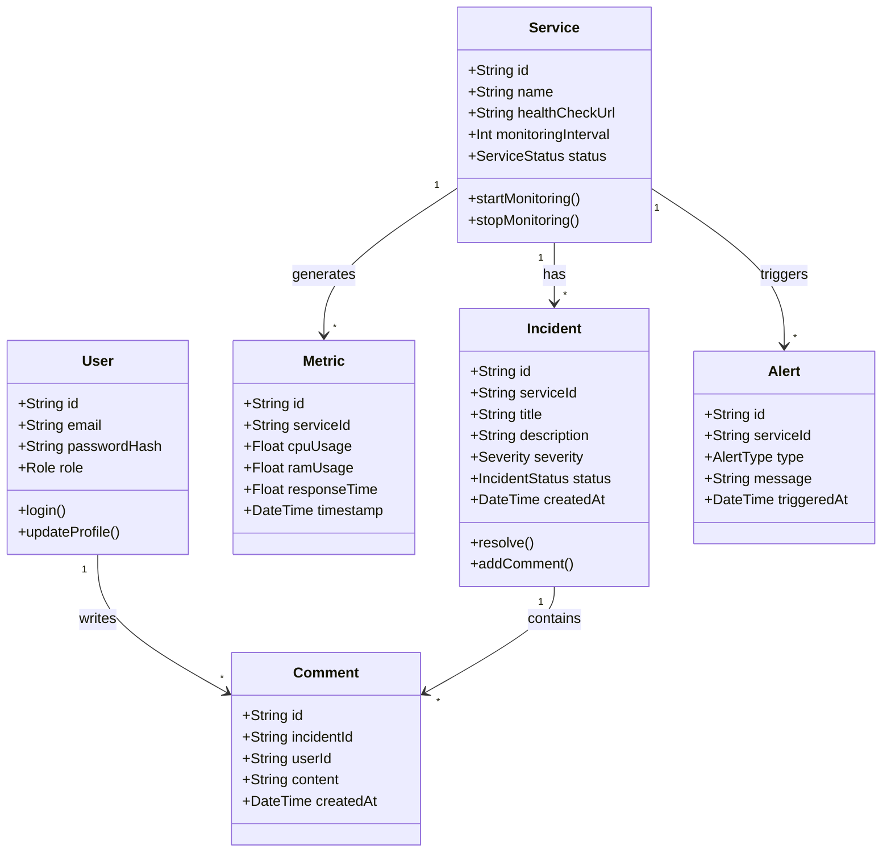

# Class Diagram: Major Classes + Relationships

```mermaid
classDiagram
    class User {
        +String id
        +String email
        +String passwordHash
        +Role role
        +login()
        +updateProfile()
    }

    class Service {
        +String id
        +String name
        +String healthCheckUrl
        +Int monitoringInterval
        +ServiceStatus status
        +startMonitoring()
        +stopMonitoring()
    }

    class Metric {
        +String id
        +String serviceId
        +Float cpuUsage
        +Float ramUsage
        +Float responseTime
        +DateTime timestamp
    }

    class Incident {
        +String id
        +String serviceId
        +String title
        +String description
        +Severity severity
        +IncidentStatus status
        +DateTime createdAt
        +resolve()
        +addComment()
    }

    class Comment {
        +String id
        +String incidentId
        +String userId
        +String content
        +DateTime createdAt
    }

    class Alert {
        +String id
        +String serviceId
        +AlertType type
        +String message
        +DateTime triggeredAt
    }

    User "1" --> "*" Comment : writes
    Service "1" --> "*" Metric : generates
    Service "1" --> "*" Incident : has
    Service "1" --> "*" Alert : triggers
    Incident "1" --> "*" Comment : contains
```
