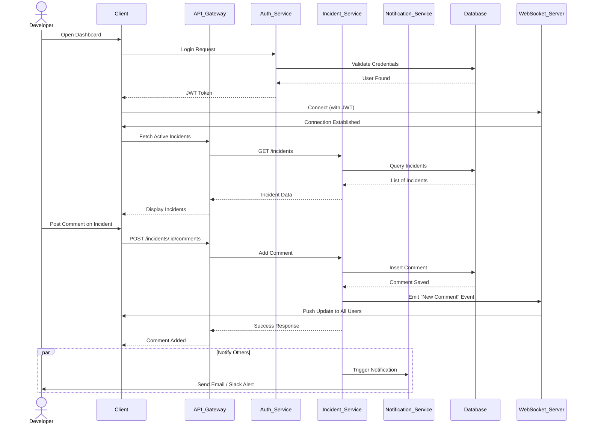

# Sequence Diagram: Main Flow (End-to-End)

```mermaid
sequenceDiagram
    actor Developer
    participant Client
    participant API_Gateway
    participant Auth_Service
    participant Incident_Service
    participant Notification_Service
    participant Database
    participant WebSocket_Server

    Developer->>Client: Open Dashboard
    Client->>Auth_Service: Login Request
    Auth_Service->>Database: Validate Credentials
    Database-->>Auth_Service: User Found
    Auth_Service-->>Client: JWT Token

    Client->>WebSocket_Server: Connect (with JWT)
    WebSocket_Server->>Client: Connection Established

    Client->>API_Gateway: Fetch Active Incidents
    API_Gateway->>Incident_Service: GET /incidents
    Incident_Service->>Database: Query Incidents
    Database-->>Incident_Service: List of Incidents
    Incident_Service-->>API_Gateway: Incident Data
    API_Gateway-->>Client: Display Incidents

    Developer->>Client: Post Comment on Incident
    Client->>API_Gateway: POST /incidents/:id/comments
    API_Gateway->>Incident_Service: Add Comment
    Incident_Service->>Database: Insert Comment
    Database-->>Incident_Service: Comment Saved
    Incident_Service->>WebSocket_Server: Emit "New Comment" Event
    WebSocket_Server->>Client: Push Update to All Users
    Incident_Service-->>API_Gateway: Success Response
    API_Gateway-->>Client: Comment Added

    par Notify Others
        Incident_Service->>Notification_Service: Trigger Notification
        Notification_Service->>Developer: Send Email / Slack Alert
    end
```
