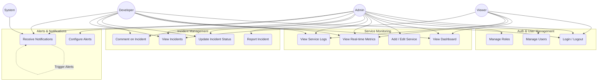

# Use Case Diagram

```mermaid
graph TD
    %% Actors
    Admin((Admin))
    Developer((Developer))
    Viewer((Viewer))
    System((System))

    %% Auth & User Management
    subgraph Auth["Auth & User Management"]
        UC1(Login / Logout)
        UC2(Manage Users)
        UC3(Manage Roles)
    end

    %% Service Monitoring
    subgraph Monitor["Service Monitoring"]
        UC4(View Dashboard)
        UC5(Add / Edit Service)
        UC6(View Real-time Metrics)
        UC7(View Service Logs)
    end

    %% Incident Management
    subgraph Incident["Incident Management"]
        UC8(Report Incident)
        UC9(Update Incident Status)
        UC10(Comment on Incident)
        UC11(View Incidents)
    end

    %% Alerts & Notifications
    subgraph Alerts["Alerts & Notifications"]
        UC12(Configure Alerts)
        UC13(Receive Notifications)
    end

    %% Relationships
    Admin --> UC1
    Admin --> UC2
    Admin --> UC3
    Admin --> UC4
    Admin --> UC5
    Admin --> UC6
    Admin --> UC7
    Admin --> UC8
    Admin --> UC9
    Admin --> UC10
    Admin --> UC11
    Admin --> UC12
    Admin --> UC13

    Developer --> UC1
    Developer --> UC4
    Developer --> UC6
    Developer --> UC7
    Developer --> UC9
    Developer --> UC10
    Developer --> UC11
    Developer --> UC13

    Viewer --> UC1
    Viewer --> UC4
    Viewer --> UC6
    Viewer --> UC7
    Viewer --> UC11

    System --> UC13 -.->|Trigger Alerts| UC13

```
